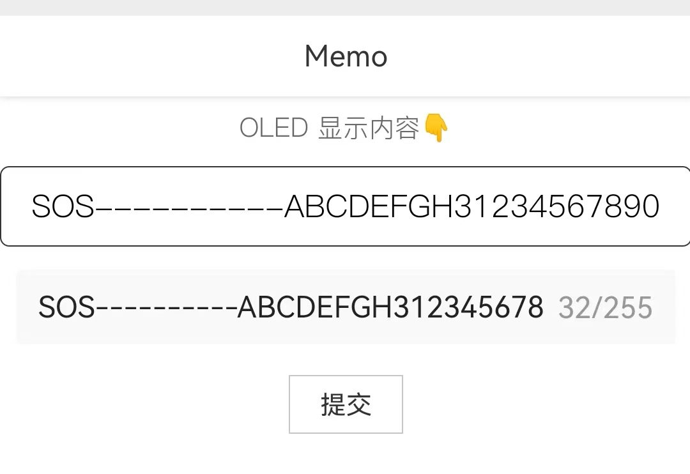
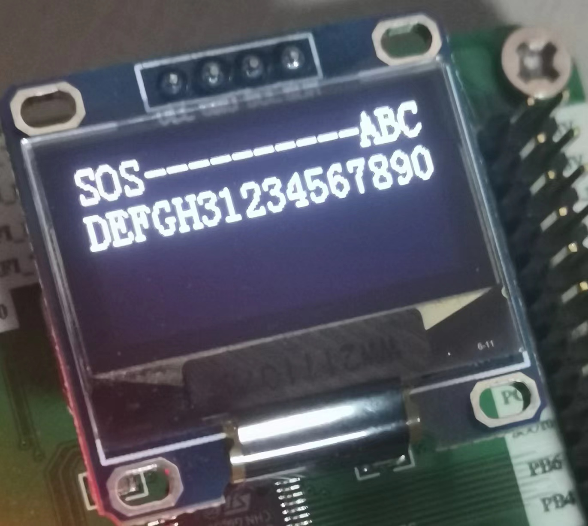
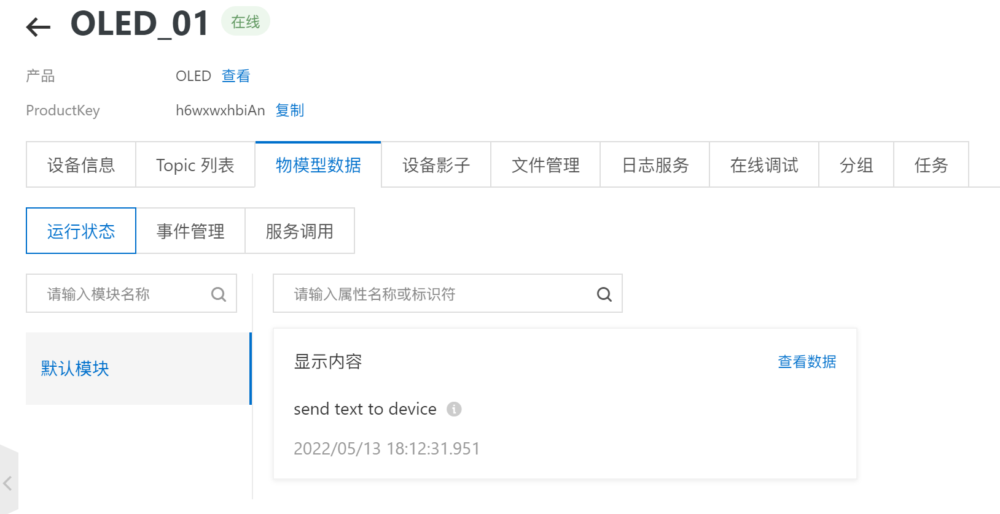
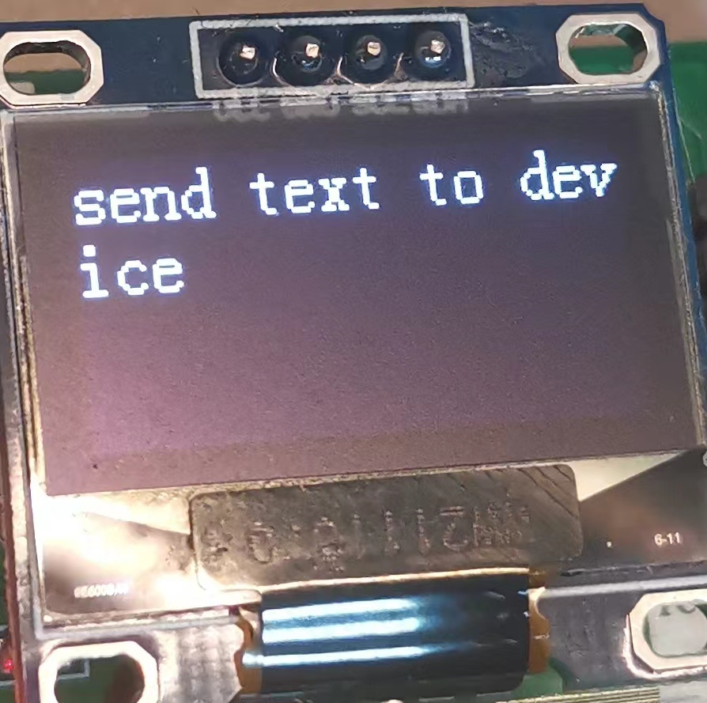

# OLED_Memo_IoT

 基于物联网的备忘录 OLED 显示

## 项目基础

本项目在 [THMS_IoT](https://github.com/Deng-Jiajun/THMS_IoT) 的基础上建立

## 硬件基础

MCU：stmf103c8t6  
温湿度检测：DHT11  
联网：esp-01s

## 基本工作流程

esp-01s 联网，与阿里云物联网平台 MQTT 服务器建立 TCP 连接，保持连接状态。  
当收到 MQTT 服务器下发的报文时，解析报文内容，更新 OLED 显示屏

## 重点模块

- IIC：实现 MCU 与 OLED 的通信协议支持
- OLED_IIC：实现 MCU 与 OLED 的实际通信
- USART：实现 MCU 的串口通信
- WiFi：实现 MCU 与 esp-01s 的通信（基于 USART2 串口通信）
- MQTT：实现 MCU 与 MQTT 服务器的通信（在 WiFi 模块的基础上实现）

## 运行结果

移动端  


设备端  


## 修改内容

### 保活模块

在 [THMS_IoT](https://github.com/Deng-Jiajun/THMS_IoT) 中，由于设备会定期向 MQTT 服务器发送 PUBLISH 报文，不存在保活的问题，但是在本程序中，可能很长的一段时间内都不会进行任何数据通信，因此有必要引入一个模块，隔一段时间发送一次 PINGREQ 报文，保证连接持续。（同时也可以引入其他的功能，比如屏保、长期无响应熄屏等）

### 接收中断处理

在 [MQTT 模块](https://github.com/Deng-Jiajun/STM32-Project/tree/main/HCDZ/MQTT) 中曾经提及，可以引入定时器来区分同一组数据，具体思路为：

> 每次触发接收中断时，就开启计时（定时器使能，计数清零），如果在 40ms 内没有再次触发接收中断，则将触发定时器中断（计时频率 40ms），将串口接收缓冲区里的数据写入缓冲队列，关闭计时（定时器失能，计数清零，清标志位）

本着少改一点算一点的原则，这里依旧不决定引入缓冲池，只是响应速度确实已经在一定程度上影响了程序功能，所以先解决响应问题

另外，分析整个程序的运行逻辑，可以发现不同模块对输入缓冲区的占用是串行的，遵循的基本逻辑是：「发送信息 → 等待响应」，不存在冲突的问题。

其中的不稳定因素是服务器下发的 PUBLISH 报文数据，该数据的

### PUBLISH 报文响应

在 [THMS_IoT](https://github.com/Deng-Jiajun/THMS_IoT) 中，由于是从设备向服务器发送设备属性，所以忽略了一点：  
在 MQTT 通信过程中，如果服务端向设备发送设置属性的 PUBLISH 报文，设备也需要发出 PUBLISH 报文作为响应，如果没有进行响应，服务端将无从得知设备是是否做出了有效响应（不论成功或是失败）


添加了响应后，问题解决






## 其他问题

### JSON 数据解析

为了解析 MQTT 服务器下发的 json 数据，引入了 json 库，但是编译不通过

```c
Error: L6915E: Library reports error: __use_no_semihosting was requested, but _ttywrch was referenced
```

查询得到解决方案，添加以下代码段即可：

```c
_ttywrch(int ch)
{
    ch = ch;
}
```

### 堆空间不足

为了解析 json 格式信息，引入了 cJSON 库，在单模块测试时没有发现问题。但是在组合使用时发现程序卡死，一路排查，发现死在了这一步：  
```c
root = cJSON_Parse(payload_json);
```

非常哟西，死在了解析的第一步，获取 root 就挂了。之前在了解 cJSON 时有注意到，获取 root 时会动态申请内存，因此大概率是空间分配出了问题，查询之后了解到，是堆空间不够，适当修改其大小即可

```
Heap_Size       EQU     0x00000200
							👇
Heap_Size       EQU     0x00001000
```

> 启动文件 `startup_stm32f10x_md.s` 第 46 行

## TODO

- 设备显示界面设计  
  目前只实现了数据传输与显示，后续需要实现一个相对友好的显示界面

- 缓冲池  
  目前已经存在的许多缺陷都是直接或间接由于没有建立缓冲池而导致的