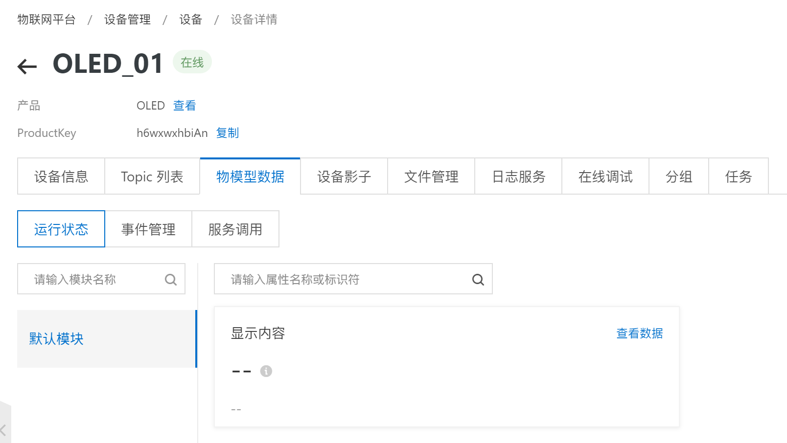
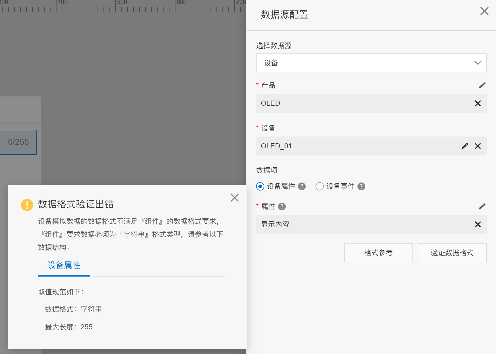

# OLED_Memo_IoT

 基于物联网的备忘录 OLED 显示

## 项目基础

本项目在 [THMS_IoT](https://github.com/Deng-Jiajun/THMS_IoT) 的基础上建立

## 硬件基础

MCU：stmf103c8t6  
温湿度检测：DHT11  
联网：esp-01s

## 基本工作流程

esp-01s 联网，与阿里云物联网平台 MQTT 服务器建立 TCP 连接，保持连接状态。  
当收到 MQTT 服务器下发的报文时，解析报文内容，更新 OLED 显示屏

## 重点模块

- IIC：实现 MCU 与 OLED 的通信协议支持
- OLED_IIC：实现 MCU 与 OLED 的实际通信
- USART：实现 MCU 的串口通信
- WiFi：实现 MCU 与 esp-01s 的通信（基于 USART2 串口通信）
- MQTT：实现 MCU 与 MQTT 服务器的通信（在 WiFi 模块的基础上实现）

## 运行结果


## 修改内容

在 [THMS_IoT](https://github.com/Deng-Jiajun/THMS_IoT) 中，由于是从设备向服务器发送设备属性，所以忽略了一点：  
在 MQTT 通信过程中，如果服务端向设备发送设置属性的 PUBLISH 报文，设备也需要发出 PUBLISH 报文作为响应，如果没有进行响应，服务端将无从得知设备是是否做出了有效响应（不论成功或是失败）






添加了响应后，问题解决


## 其他问题

### JSON 数据解析

为了解析 MQTT 服务器下发的 json 数据，引入了 json 库，但是编译不通过

```c
Error: L6915E: Library reports error: __use_no_semihosting was requested, but _ttywrch was referenced
```

查询得到解决方案，添加以下代码段即可：

```c
_ttywrch(int ch)
{
    ch = ch;
}
```

### 堆空间不足

为了解析 json 格式信息，引入了 cJSON 库，在单模块测试时没有发现问题。但是在组合使用时发现程序卡死，一路排查，发现死在了这一步：  
```c
root = cJSON_Parse(payload_json);
```

非常哟西，死在了解析的第一步，获取 root 就挂了。之前在了解 cJSON 时有注意到，获取 root 时会动态申请内存，因此大概率是空间分配出了问题，查询之后了解到，是堆空间不够，适当修改其大小即可

```
Heap_Size       EQU     0x00000200
							👇
Heap_Size       EQU     0x00001000
```

> 启动文件 `startup_stm32f10x_md.s` 第 46 行

## TODO

1. 修改中断处理程序，以 40ms 为间隔，区分是否为一个完整的数据
2. 建立输入/输出**缓冲池/缓冲队列**，把同一组数据写入同一块缓冲
